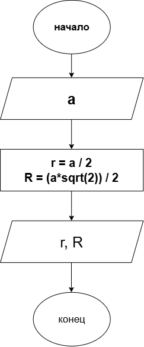

# Домашнее задание к работе 3

## Условие задачи
Написать и отладить программу расчета радиуса описанной и вписанной окружности для квадрата со стороной а (вещественное значение а задает пользователь).
## 1. Алгоритм и блок-схема

### Алгоритм
1. **Начало**
2. Объявить переменные:
 a
3. Вычисления
 
      Радиус вписанной окружности равен: 
      r = a / 2 

      Радиус описанной окружности равен: 
      R = (a * sqrt(2)) / 2

4. Вывод ответа
   r, R

5. Конец

# Блок схема:

## 2. Реализация программы
    #include <stdio.h>
    #include <math.h>
    #include <locale.h> 

    int main() 
    {
    setlocale(LC_ALL, "Russian");

    float a;

    printf("Введите сторону квадрата: ");
    scanf_s("%f", &a);

    
    float r = a / 2;
    float R = (a * sqrt(2)) / 2;

    printf("Радиус вписанной окружности: %.2f\n", r);
    printf("Радиус описанной окружности: %.2f\n", R);

    return 0;
    }

# Результаты работы программы
Введите сторону квадрата: 4

Радиус вписанной окружности: 2,00

Радиус описанной окружности: 2,83

# Информация о разработчике
Порошкова Кристина
бОТИ-262