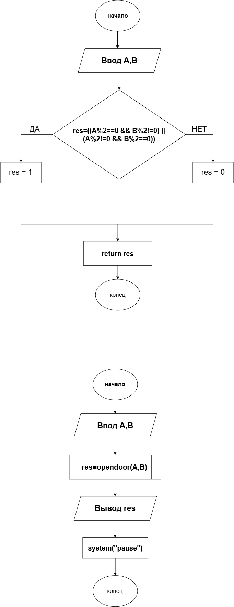

# Домашнее задание к работе 4

## Условие задачи
В умном коворкинге два сканера: по лицу (A) и по карте (B). Система открывает дверь, если ровно один из сканеров вернул четный код доступа (такие коды выдаются временным посетителям). Запишите условие открытия двери.
## 1. Алгоритм и блок-схема

### Алгоритм
1. **Начало**
2. Ввести код сканера A.
   
   Ввести код сканера B.
3. Проверить, является ли A чётным.
                       
   Проверить, является ли B чётным.
4. Выполнить операцию исключающее ИЛИ:
   
   res = (A % 2 == 0) ^ (B % 2 == 0).

5. Вывод ответа:
   res

6. Конец

# Блок схема:

## 2. Реализация программы
    #include <stdio.h>
    #include <locale.h>
    #include <stdlib.h>  
    int opendoor(int A, int B)
    {
    int res;
    res = ((A% 2 == 0 && B % 2 != 0) || 
           (A% 2 != 0 && B% 2 == 0) );
    return res;
    }
    int main()
    {
    setlocale(LC_ALL, "Russian");
    int A, B, res;
    printf("Введите код сканера A: \n");
    scanf_s("%d", &A);
    printf("Введите код сканера B: \n");
    scanf_s("%d", &B);
    res = opendoor(A, B);      
    printf("Результат (1 - открыть, 0 - закрыть) : %d\n", res);
    system("pause");
    }

# Информация о разработчике
Порошкова Кристина
бОТИ-262